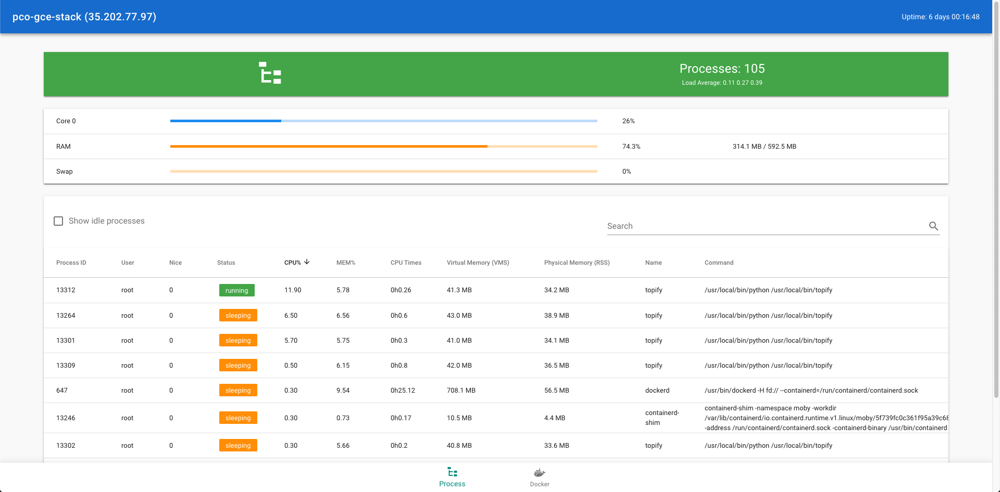

# topify

A user-friendly top-like monitoring

[](https://opensource.org/licenses/Apache-2.0)
[]()
[]()
[](https://github.com/ambv/black)



# How to launch

* docker run
```
docker run \
--rm \
-d \
--name topify \
--pid host \
--network host \
--volume "/var/run/docker.sock:/var/run/docker.sock" \
--volume "/etc/os-release:/etc/os-release:ro" \
--volume "/etc/passwd:/etc/passwd:ro" \
--volume "/etc/group:/etc/group:ro" \
-e "REFRESH_INTERVAL=1000"
pcorbel/topify:v0.1.0 
```

* docker-compose
```
docker-compose up -d topify
```

Then open your browser to [localhost:5000](localhost:5000)

# How to add a custom collector

Simply add your class in the [topify/collectors](https://github.com/pcorbel/topify/tree/master/topify/collectors) directory.

The class should inherit from [BaseCollector](https://github.com/pcorbel/topify/blob/master/topify/common/base_collector.py)

The data of the collector will be exposed on a Flask endpoint named after the `_id` attribute.

# Example of custom collector

* topify/collectors/my_collector.py
```
#!/usr/bin/env python
# -*- coding: utf-8 -*-

from dataclasses import dataclass
from ..common.base_collector import BaseCollector

@dataclass
class MyCollector(BaseCollector): # Inherit from BaseCollector
    _id: str = "my_collector" # The endpoint will be named after that. Required
    my_custom_value: int = 0 # A value of the collector

    def collect(self) -> None: # The collect method that will be called to update the values of the collector. Required
        self.my_custom_value += 1 

```

* curl to access the collector value
```
$ curl -X GET "http://localhost:5000/my_collector" -H "accept: application/json"
{"_id": "my_collector", "my_custom_value": 30}
```

# Roadmap

* Use [expandable datatable](https://vuetifyjs.com/en/components/data-tables#slot-expand) to show raw data from the collector
* Integrate more [psutil.network](https://psutil.readthedocs.io/en/latest/#network) functions to compute rate per second
* Integrate more [psutil.network](https://psutil.readthedocs.io/en/latest/#network) functions to make an iftop-like view
* Try to reduce footprint by moving from Flask to [aiohttp](https://github.com/aio-libs/aiohttp)